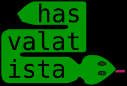

# Feladat 
Szerbiába egy új külföldi befektető, a GYÍK érkezett, akinek az első üzleti tevékenysége egy herpetológiai üzlet megnyitása Belgrád központjában. Az üzleti terv elkészült, de problémák merültek fel az üzlet nevének megválasztása során.

A GYÍK vezetői és a PR szakemberei megállapították, hogy fontos, hogy a bejárati ajtó felett elhelyezett logó kígyó alakú legyen, és tartalmazza a kiválasztott nevet: a logó első sorának szövegét balról jobbra kell olvasni, a második sort jobbról balra, tehát így a második sor kezdete ugyanazon a pozíción van, mint az első sor vége; a harmadik sort balról jobbra kell olvasni, és a harmadik sor eleje ugyanazon a pozíción lesz, mint a második sor vége, és így tovább.

A logó bármennyi sort tartalmazhat (akár egyet is), és minden sornak legalább két betűt kell tartalmaznia. Például a “ hastalavista ” szó az alábbi módon írható le kígyó alakban:

        hast
         ala
         vista

Nem minden kígyóforma egyformán jó.
A szakértők megállapították, hogy a legmegfelelőbb logó az adott szó esetén az, amelyiknek a legnagyobb a kígyóscoreja.
A kigyóscore (rendezetlen) betűpárok számaként definiálható, amikor azok egy ütemben vannak egymás felett. Például, az említett kígyónak a kigyóscoreja 1: az első és a harmadik “ а ” betűk egymás felett vannak. Azonban a kigyóscore 2re is növelhető az alábbi kígyóval:

            has
         ivalat
         sta

A GYÍK embereinek megvan az ötlete az üzletnévre, azonban nem tudják, hogyan kellene kinéznie az optimális logónak. Úgy döntöttek, hogy hozzátok, ifjú programozókhoz fordulnak segítségért, annak érdekében, hogy megoldjátok a problémát, hogy minél több ügyfelet vonzzanak be. Segítsetek a GYÍK csapatának, a lehető legnagyobb jövedelmet biztosítani!

## Bemenet
A szabványos bemenet első és egyetlen sorában szerepel a herpetológiai üzlet nevét jelző karakterlánc, amely az angol ábécé kis betűiből áll.

## Kimenet
A szabványos kimenet első és egyetlen sorában egy nemnegatív egész szám szerepel, mégpedig az elérhető legmagasabb kigyóscore, amely az ajánlott név valamilyen kígyó alakú elrendezésével kapható meg.

## Korlátozások
- A karakterlánc az angol ábécé kisbetűiből áll.
- A karakterlánc nem tartalmazhat több, mint 3000 jelet, és kettőnél kevesebbet sem.
- A tesztpéldák három diszjunkt csoportba vannak sorolva:
    - A 30 pontot érő tesztpéldákban: A karakterlánc nem tartalmaz 100-nál több jelet.
    - A 20 pontot érő tesztpéldákban: A karakterlánc több, mint 100, de nem több, mint 500 jelet tartalmaz.
    - Az 50 pontot érő tesztpéldákban: Nincsenek további korlátozások.
## Példák
### Példa 1
- Bemenet
    - hastalavista
- Kimenet
    - 2
- Magyarázat
    - Példa a feladat leírásából.
### Példa 2
- Bemenet
    - anavolimilovana
- Kimenet
    - 0
- Magyarázat
    - Egyik ütemben sem helyezhetők egymásra betűpárok.
### Példa 3
- Bemenet
    - abccbbcaac
- Kimenet
    - 6
- Magyarázat
    - Az optimális felosztás az alábbi:

        
            abc
             bc
             bca
              ca

        Két esetben van b betű b betű felett, három esetben van c betű c betű felett, és egy alkalommal van a betű a betű felett, amely így összesen megadja, hogy a kigyóscore értéke: 6. 