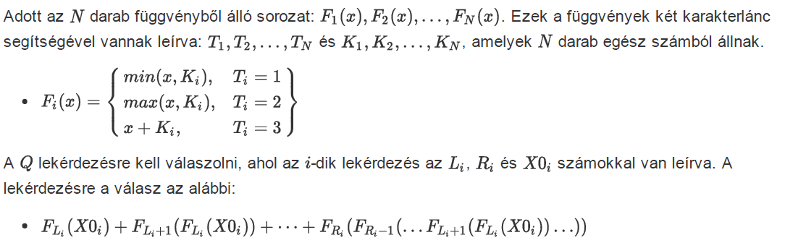

# Feladat 

## Bemenet
A szabványos bemenet első sorában az N szám található.

A szabványos bemenet második sorában N darab egész szám található, ahol i-dik szám Ti-vel van jelölve. A szabványos bemenet harmadik sorában N darab egész szám található, ahol i-dik szám Ki-vel van jelölve.

A szabványos bemenet negyedik sorában a Q szám található.

A többi Q sor mindegyikében 3 egész szám található, az i-dikben az Li, Ri és X0i számok.

## Kimenet
A szabványos kimenetre a lekérdezéskre adott választ kell kiíratni, külön sorokban.

## Korlátozások
- 1 ≤ N,Q ≤ 2*10^5
- 0 ≤ |Ki| ≤ 10^9, Ti ∈ {1,2}-re
- 0 ≤ |Ki| ≤ 10^6, Ti = 3-ra
- 1 ≤ Li ≤ Ri ≤ N
- 0 ≤ N ≤ 10^9
- Az tesztpéldák 5 diszjunkt csoportba vannak sorolva:
    - A 8 pontot érő tesztpéldákban: N,Q ≤ 10^3.
    - A 20 pontot érő tesztpéldákban: Ti = 3, minden 1 ≤ i ≤ N-re.
    - A 20 pontot érő tesztpéldákban: Ti = 1, minden 1 ≤ i ≤ N-re.
    - A 24 pontot érő tesztpéldákban: N,Q ≤ 4*10^4.
    - A 28 pontot érő tesztpéldákban: nincs külön korlátozás.
## Példák
### Példa 1
- Bemenet
    - 5

        3 3 2 1 3

        3 8 ‐7 ‐6 ‐6

        2

        1 1 4

        1 4 ‐5
- Kimenet
    - 7

        4
- Magyarázat
    - F1(x) = x + 3
    - F2(x) = x + 8
    - F3(x) = max(x, -7)
    - F4(x) = min(x, -6)
    - F5(x) = x - 6
    - Az első lekérdezésre: F1(4) = 7
    - A második lekérdezésre: F1(-5)+F2(F1(-5))+F3(F2(F1(-5)))+F4(F3(F2(F1(-5))))= -2+F2(-2)+F3(F2(-2))+F4(F3(F2(-2)))= -2+6+F3(6)+F4(F3(6))= -2+6+6+F4(6)= -2+6+6-6= 4
### Példa 2
- Bemenet
    - 10

        1 1 2 2 1 2 3 2 1 3

        0 10 ‐7 ‐15 ‐13 ‐7 ‐4 4 12 ‐15

        6

        9 9 11

        1 9 ‐7

        7 7 ‐20

        1 8 6

        9 10 ‐2

        9 10 ‐13
- Kimenet
    - 11

        ‐51

        ‐24

        ‐27

        ‐19

        ‐41